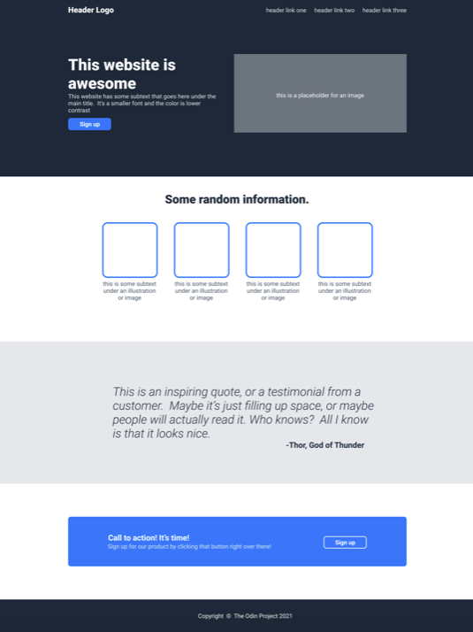

# TOP-LandingPage

This exercise uses basic html and css to create a landing page that is supposed to look something like below:

Project from: The Odin Project https://www.theodinproject.com/paths/foundations/courses/foundations/lessons/landing-page
